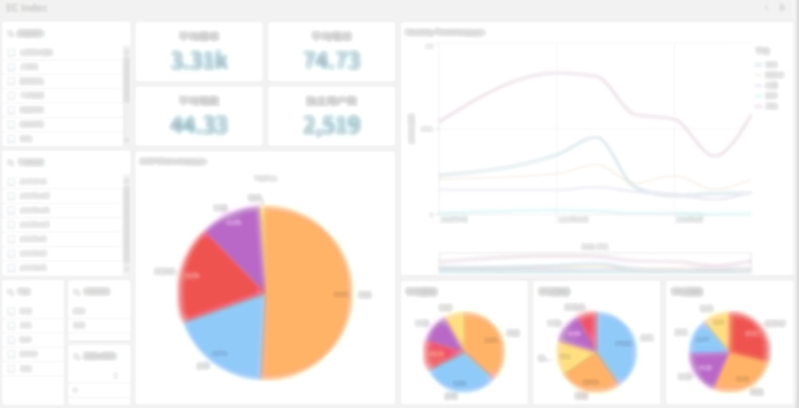

# 🛍️ eCommerce Data Analytics Dashboard  
**Role: Project Manager**

## 📌 Project Summary

Led the end-to-end design and implementation of an eCommerce analytics dashboard system to support business decision-making and platform optimization. The project aimed to uncover user behavior patterns and evaluate the performance of various product categories through comprehensive data modeling, analysis, and visualization.

---

## 🎯 Key Responsibilities & Achievements

### 🔧 Data Preparation & Modeling
- Built a robust data pipeline using Qlik scripting (`LOAD` statements), integrating **2,000+ transaction records**.
- Unified data across multiple dimensions including:
  - **User profiles**: gender, age group, city tier, income level
  - **Order details**: platform, status, order amount, product category, time slot
  - **Product details**: item count, SKU-level info

### 📐 KPI Framework Design
Defined and implemented key commercial performance indicators, including:
- **ARPU (Average Revenue Per User)**
- **Average Items Per Order**
- **Order Frequency**
- **Unique Buyer Count**

These KPIs served as core evaluation metrics for monthly performance across platforms and categories.

### 🔍 Multi-Dimensional Analysis
- Conducted deep-dive analysis on **"New Category 3.0"** product lines.
- Explored conversion and repurchase drivers by correlating metrics with user segments and order times.
- Identified critical factors influencing performance by category and demographic.

### 📊 Trend Visualization
- Designed interactive dashboards using Qlik for real-time business insights.
- Visualized trends in:
  - **Monthly transaction volume**
  - **Category comparison**
  - **User activity by platform**
---

---
### 🤝 Collaboration & Delivery
- Coordinated efforts between data engineering and business analytics team members.
- Ensured analytical accuracy and interpretability of findings.
- Delivered actionable insights on time for use by marketing and product strategy teams.

---

## 🚀 Business Impact

This project significantly enhanced the team’s understanding of:
- Consumer behavior trends
- Product category performance  
It also provided analytical support for **targeted marketing** and **platform optimization initiatives** that followed.

> Last updated: April 2025