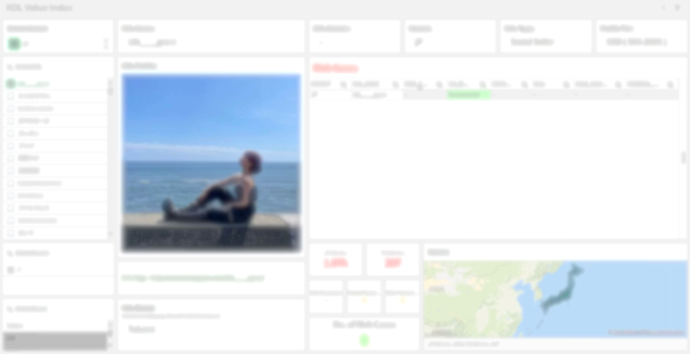

# 📊 KOL Monitoring Dashboard

## 🧩 Project Overview

This project is designed to monitor KOL (Key Opinion Leader) activity and risk across multiple markets. It integrates data from reporting and profile databases, providing visibility into KOL engagement, risk classification, and demographic distribution. The system supports market-specific analytics (e.g., JP, TW), gender-based segmentation, and keyword-based tracking.

---

## 📌 Dimensions & Measures

### Dimensions
- `MARKET_CODE`: Market (e.g., JP, TW)
- `USER_ALIAS`: KOL name (anonymized)
- `USER_GENDER`: Gender of KOL
- `ACCOUNT_TYPE`: Type of activation
- `ACCOUNT_TIER`: Tier of the KOL profile
- `RISK_TYPE`: Risk classification category
- `POST_KEYWORD`: Keyword extracted from original posts
- `POST_TIMESTAMP`: Post publish time

### Measures
- `POPULATION_JP`: Count of distinct KOLs in Japan
- `POPULATION_TW`: Count of distinct KOLs in Taiwan
- `POPULATION_MALE`: Count of male KOLs
- `POPULATION_FEMALE`: Count of female KOLs
- `RISK_LEVEL`: Categorical field indicating risk severity

---

---

## 📈 KPI Definitions

| KPI Name           | Definition                                                                 |
|--------------------|----------------------------------------------------------------------------|
| KOL Count (Market) | Count of distinct `USER_ALIAS` per `MARKET_CODE`                          |
| Risk Incidents     | Count of entries with `RISK_TYPE` not null                                 |
| Gender Split       | Distribution of `USER_GENDER` over total KOLs                              |
| Keyword Frequency  | Count of occurrences of each `POST_KEYWORD`                                |
| Posting Trend      | Timeline of posts over `POST_TIMESTAMP`                                   |

---

## 🎛️ Filter Design

The dashboard supports the following filter panels:
- `Market Selector`: Filter by `MARKET_CODE`
- `Gender Selector`: Filter by `USER_GENDER`
- `Risk Category`: Filter by `RISK_TYPE`
- `Time Range`: Based on `POST_TIMESTAMP`
- `KOL Tier`: Based on `ACCOUNT_TIER`

---

## ⚙️ Script Logic Summary

1. Connect to database `KOL`
2. Load reporting data from `[KOL_INDEX_VM_REPORTING]`
3. Load profile data from `[KOL_PROFILE]`
4. Perform counts based on:
   - Market: JP, TW
   - Gender: M, F
5. Assign values to global variables:
   - `vPopulation_JP`, `vPopulation_TW`, `vPopulation_M`, `vPopulation_F`

---

## 🧬 Field Mapping Reference

| Original Field       | Renamed As            | Description                      |
|----------------------|------------------------|----------------------------------|
| `MARKET`             | `MARKET_CODE`          | Region/market code               |
| `PROFILE_URL`        | `USER_PROFILE_LINK`    | KOL profile page URL             |
| `KOL_NAME`           | `USER_ALIAS`           | KOL name (masked)                |
| `ORIGINAL_POST`      | `POST_ORIGIN`          | Original post content            |
| `CASE_SUMMARY`       | `POST_SUMMARY`         | Summary of reported content      |
| `POST_TIME`          | `POST_TIMESTAMP`       | Time when post was made          |
| `KEYWORD`            | `POST_KEYWORD`         | Extracted keyword                |
| `VM_RISK_LEVEL`      | `RISK_LEVEL`           | Risk level label                 |
| `RISK_CATEGORY`      | `RISK_TYPE`            | Risk category (e.g., offensive)  |
| `KOL_NUM`            | `USER_ID`              | Internal KOL ID                  |
| `ACTIVATION_TYPE`    | `ACCOUNT_TYPE`         | KOL account activation type      |
| `PROFILE_TIER`       | `ACCOUNT_TIER`         | KOL tier (e.g., micro, macro)    |
| `IMAGE`              | `PROFILE_IMAGE`        | Profile image (if applicable)    |

---

> Last updated: `2025-04-15`
