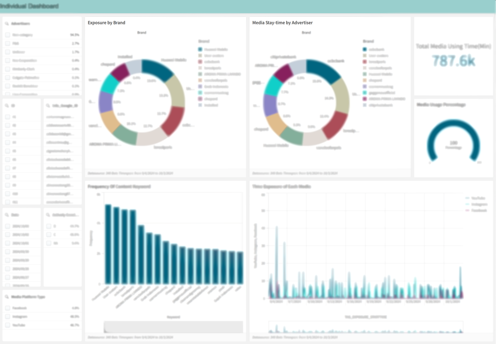

# Media Advertisement Tracking Dashboard

## 📌 Project Overview  
**Project Name**: APAC Emerging Markets Ad Performance Monitor  
**Background**: SaaS QlikView solution for tracking media advertisement performance across emerging APAC markets. Automates data collection from multiple platforms to:  
- Visualize advertising trends & campaign performance  
- Compare cross-platform metrics (impressions, engagement, etc.)  
- Identify emerging patterns through continuous monitoring  
- Support data-driven media buying decisions  

---

## 🗂️ Data Structure  

### Source Systems  
1. QVD Archive: Historical data stored in `lib://Data_*.qvd`  
2. Oracle DB: Incremental data via `Ad-Database`  

### Core Fields  

| Database Field → Qlik Field          | Type      | Description                     |  
|--------------------------------------|-----------|---------------------------------|  
| MOBILE_DEVICE_ID → FIELD_DEVICE_ID   | Dimension | Unique device identifier        |  
| MEDIA_CLOSE_TIME → FIELD_CLOSE_TIME  | Dimension | Ad interaction timestamp        |  
| BRAND → FIELD_BRAND                  | Dimension | Filtered non-blank values       |  
| ADS_STAY_TIME → FIELD_STAY_TIME      | Measure   | Engagement duration (seconds)   |  
| ADS_ORDER → FIELD_AD_ORDER           | Measure   | Ad sequence priority            |  

---

## 🎯 KPIs & Metrics  

### Key Performance Indicators  
1. Engagement Rate: Total stay time divided by number of unique devices  
2. Campaign Reach: Count of distinct user IDs  
3. Ad Frequency: Ad count per unique device  

### Targeting Logic  
Sample user profile filter includes ads with class in 'Premium' or 'Video', ad type 'Interactive', and media close time within the selected analysis date range  

### 🔍 Filter Architecture  

**System-Level Filters**  
- FIELD_BRAND not in ('Unrecognized', 'Skip ad')  
- Excludes FIELD_BRAND patterns like '*profile*'  
- Enforced date range between start and end date variables  

**Dashboard Filters**  
- Temporal: Rolling 7D/30D windows, custom date range picker  
- Content: Brand whitelist, ad type (Video/Display/Interactive), campaign tier (A/B/C classes)  

---

## ⚙️ Script Logic  

### Data Pipeline  

1. Check if QVD file exists  
2. If yes, load max media close date  
3. If the latest date in QVD is older than the end date, perform an incremental load from multiple databases (e.g., Oracle databases) based on the last processed TAG_MEDIA_CLOSE_TIME.
   1. For Database 1: Incremental load for specific advertiser names (e.g., 'A', 'B', etc.).
   2. For Database 2: Incremental load for different advertiser names (e.g., 'C', 'D', etc.).
4. If no QVD or no update, either reuse QVD or extract full data from DB 
   1. Load data from both Database 1 and Database 2 for the full date range.
5. Concatenate new data and store updated QVD  

### Critical Paths  

- **QVD Initialization**: File existence check ensures continuity  
- **Incremental Load**: Only fetches records newer than max date  
- **Data Hygiene**: Temporary tables dropped to manage memory footprint  

---

## 🔄 Field Mapping  

| Source Field (Oracle)         | Qlik Field               | Transformation                  |  
|-------------------------------|---------------------------|----------------------------------|  
| MEDIA_USER_SESSION            | FIELD_USER_ID            | Extracts first 8 characters      |  
| EXPOSURE_STARTTIME / ENDTIME  | FIELD_EXPO_START / END   | UTC to local timezone conversion|  
| CAMPAIGN_CONTENT              | FIELD_CAMPAIGN_CONTENT   | Removes HTML tags               |  

---

## 🧠 Constraints  

- **Temporal Scope**: Default analysis range is 2024-09-04 to 2024-10-04  
- **File Partitioning**: QVD files are monthly segmented  
- **Data Quality**: Blank brands are invalid; short session IDs treated as test data  
- **System Config**: Oracle uses read replica; QlikView script scheduled daily at 02:00 GMT+8  

---

This documentation combines technical implementation details with business context for both developer and analyst audiences. Adjust connection strings and date ranges as needed for your environment.

# Data Masking Overview

## Project Overview

This dataset contains information related to user behavior, including interactions with advertisements and video content. The data has been processed to ensure that sensitive personal information is protected by anonymizing or masking identifiable fields.

---

## Data Structure

### Source Systems
1. **Google Drive File**: Data loaded from the provided Excel file hosted on Google Drive.
2. **Data Table**: `Data.xlsx` file contains the raw data with embedded labels for field names.

### Core Fields

| Original Field         | Masked Qlik Field        | Description                   |
|------------------------|--------------------------|-------------------------------|
| Users                  | TAG_USER_ID              | Anonymized user ID            |
| QuickBackup            | Info_Quick_ID            | User backup information       |
| GoogleID(email)        | Info_Google_ID           | Anonymized Google email       |
| Group                  | Info_Gender_Age          | Generalized demographic group |
| Script                 | Info_Actively_Considering | Ad interaction status         |
| ad                     | Info_Ad_Blocker          | Indicates ad blocker usage    |
| video                  | Info_Video               | Video interaction behavior    |
| region                 | Info_Region              | Geographical region data      |
| Skip_Behavior          | Info_Skip_Behavior       | Behavior related to ad skipping |
| SYS_Model              | Info_SYS_Model           | System model identifier       |
| SYS_Version            | Info_SYS_Version         | System version information    |
| DeviceID               | Info_Device              | Anonymized device identifier  |

---

## Data Masking & Anonymization

The data provided contains several fields that were masked or anonymized for privacy reasons:
- **Email and DeviceID**: These fields have been anonymized to avoid direct personal identification.  
- **User Identifiers**: Any personal information related to users has been anonymized or generalized (e.g., **Users** field).
- **Demographic Data**: Group information is generalized to **Info_Gender_Age** to avoid exposing sensitive demographic details.

---

## Notes
- Please ensure that all sensitive fields are properly masked before sharing or storing the data.
- The data transformation steps and the corresponding anonymized fields will allow for meaningful analysis without exposing personal details.
